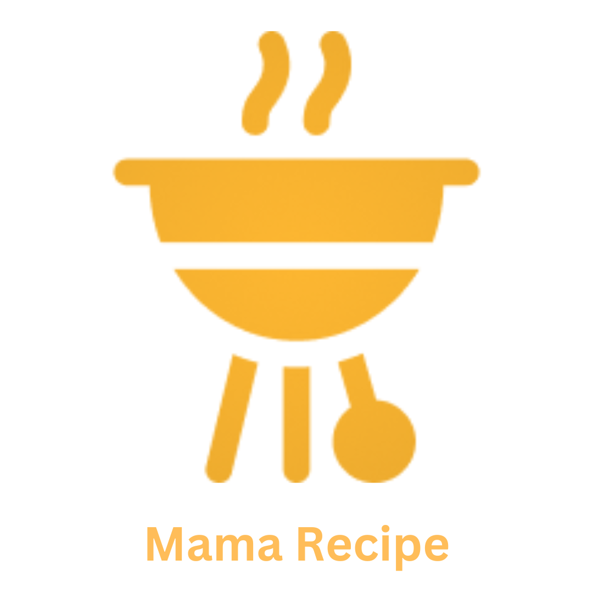

<br />
<p align="center">
  <div align="center">
    
  </div>
  <h3 align="center">Mama Recipe (Recipe App)</h3>
  <p align="center">
    <a href="https://github.com/itsarsile/food_recipe_be"><strong>Explore the docs »</strong></a>
    <br />
    <a href="https://foodrecipekel2.netlify.app/">View Demo</a>
    ·
    <a href="https://food-recipe-be.onrender.com/recipes">Api Demo</a>
  </p>
</p>

## Table of Contents

- [Table of Contents](#table-of-contents)
- [About The Project](#about-the-project)
  - [Built With](#built-with)
- [Installation](#installation)
  - [Documentation](#documentation)
  - [Related Project](#related-project)
- [Contributors](#contributors)
  - [Meet The Team Members](#meet-the-team-members)

# About The Project

MamaRecipe is a food recipe website project that aims to inspire users to cook and share their favorite recipes. The name MamaRecipe means "let's cook" in Indonesian. On this website, users can search for recipes, share their own recipes, and connect with other food enthusiasts.

One of MamaRecipe's main features is its user-friendly search function. Users can search for recipes by food name. The website also provides detailed recipe instructions, ingredient lists, and video tutorials to assist users in the cooking process.

Another unique feature of MamaRecipe is that users can create their own profiles, connect with other users, and share their favorite recipes. This allows users to learn from each other and explore new culinary ideas.

To use the MamaRecipe website, users simply need to create an account and start searching or sharing recipes. The site is designed to be easy to use and accessible to all levels of culinary expertise

## Built With

These are the libraries and service used for building this backend API

- [Node.js](https://nodejs.org)
- [Express](https://expressjs.com)
- [Supabase](https://supabase.com/)
- [Json Web Token](https://jwt.io)
- [Multer](https://github.com/expressjs/multer)
- [Cloudinary](https://cloudinary.com/)

# Installation

Follow this steps to run the server locally :

1. Clone this repository

```sh
git clone https://github.com/itsarsile/food_recipe_be
```

2. Change directory to food_recipe_be

```sh
cd food_recipe_be
```

3. Install all of the required modules

```sh
npm install
```

4. Create Supabase database

5. Create and configure `.env` file in the root directory, example credentials are provided in [.env.example](./.env.example)

```txt
- Please note that this server requires Google Drive API credentials and Gmail service account
- Otherwise API endpoint with image upload and account register won't work properly
```

6. Run this command to run the server

```sh
npm run server
```

- Or run this command for running in development environment

```sh
npm run dev
```

- Run this command for debugging and finding errors

```sh
npm run lint
```

## Documentation

Documentation files are provided in the [docs](./docs) folder

- [Postman API colletion](./docs/Markisak-be.postman_collection.json)
- [PostgreSQL database query](./docs/markisak-database-query.sql)
- [Database diagram](./docs/markisak-database-diagram.png)

API endpoint list are also available as published postman documentation

[](https://documenter.getpostman.com/view/26309865/2s93XsYSGG)

## Related Project

:rocket: [`Backend FoodRecipe`](https://github.com/itsarsile/food_recipe_be)

:rocket: [`Frontend FoodRecipe`](https://github.com/itsarsile/food_recipe)

:rocket: [`Demo FoodRecipe`](https://foodrecipekel2.netlify.app/)

# Contributors

This backend API is created by 2 backend team members, where each member have different tasks

[@itsarsile (Aji Prio Sejati)](https://github.com/itsarsile) :

- Team leader
- Relational database design
- Recipes CRUD
- Videos CRUD
- Email verification implementation
- Liked Recipes CRUD
- Saved Recipes CRUD
- Backend deployment

[@AnandaFPP (Ananda Fadhilah Perkasa Putra)](https://github.com/AnandaFPP) :

- Users CRUD
- Authentication
- Json web token implementation
- Multer implementation
- Comments CRUD
- Postman API documentation

## Meet The Team Members

<center>
  <table align="center">
    <tr >
      <th >Backend Developer / Project Manager</th>
      <th >Backend Developer</th>
      <th >Frontend Developer</th>
      <th >Frontend Developer</th>
      <th >Frontend Developer</th>
    </tr>
    <tr >
      <td align="center">
        <a href="https://github.com/itsarsile">
          <br/>
          <b>Aji Prio Sejati</b>
        </a>
      </td>
      <td align="center">
        <a href="https://github.com/AnandaFPP">
          <br/>
          <b>Ananda Fadhilah Perkasa Putra</b>
        </a>
      </td>
      <td align="center">
        <a href="https://github.com/YuSetiawan">
          <br/>
          <b>Yusuf Setiawan</b>
        </a>
      </td>
      <td align="center">
        <a href="https://github.com/flyinvyn">
          <br/>
          <b>Alfin Yahya Alyasih</b>
        </a>
      </td>
      <td align="center">
        <a href="https://github.com/alridho12">
          <br/>
          <b>Raja Al Ridho</b>
        </a>
      </td>
    </tr>
  </table>
</center>

Project link : [https://github.com/itsarsile/food_recipe_be](https://github.com/itsarsile/food_recipe_be)